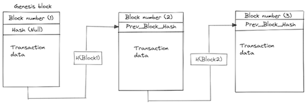
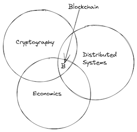
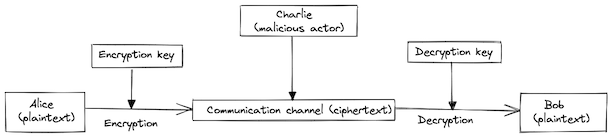
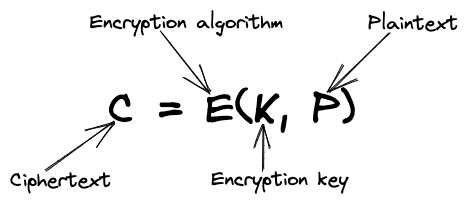

<base target="_blank">

> Blockchain is a distributed ledger technology that stores transactions in blocks that are cryptographically linked together to form a chain.

Since the launch of the Bitcoin network in 2009, there's been a lot of excitement around cryptocurrencies and other blockchain-based platforms, that facilitate transactions between different parties without the need of a single trusted third party. From DeFi to NFTs, blockchain has arguably become one of the most "hyped" technologies in recent years.

#### So, what is Blockchain?

At a basic level, a blockchain is a distributed digital ledger that stores transactions in blocks that are cryptographically linked together to form a chain. More technically, a blockchain can be considered as an append-only linked list data structure, with each block (list element) storing a cryptographic hash value ("pointer") of the previous block. This hash-based back-linking property makes the blockchain largely tamper-proof, and ensures data immutability. A simple illustration of a blockchain is shown below:

The first block in a blockchain is typically called the _**genesis block**_ (hence its hash value is _null_).

In general, a blockchain usually has the following main components:

- A peer-to-peer (p2p) network connecting the individual participating nodes. With decision-making authority decentralized among the participating nodes, there's no single node that has a "final say" in a blockchain-based system
- A consensus mechanism that helps determine what transaction blocks are valid, and can therefore be added to the blockchain
- A state machine that processes transactions according to the consensus rules. Transactions usually trigger state transitions within the state machine.

Blockchains can be classified into two broad categories:

1. Permissionless/Public blockchains: For this type, participating nodes don't need any authorization before joining the network. Main examples here are Bitcoin and Ethereum
2. Permissioned/Private blockchains: These require nodes to be authorized (or "invited") to participate in the blockchain network. The network can either belong to a single private enterprise or a consortium of several organizations that need to collaborate via a blockchain platform. Most of the blockchain projects under the [Hyperledger](https://www.hyperledger.org/) umbrella fall into this category.

At a high level, blockchain technology encompasses three disciplines:

- Distributed systems - proper coordination between participating nodes of a p2p network
- Cryptography - secure transaction data in the blockchain - and make the platform tamper-proof
- Economics - incentives for participating parties within the blockchain ecosystem

Being essentially a distributed system at the core, a blockchain system has to deal with some of the same issues that are central to distributed systems in general, like:

- Scalability
- Security (and privacy)
- Fault tolerance
- Distributed consensus mechanisms

#### Cryptography basics
In simple terms, cryptography can be described as the practice (or study) of concealing data against unauthorised access. And the process of concealing that data is usually termed as **encryption**, that is, encoding a message so that its meaning is not obvious to a non-authorised entity.

Let's say Alice wants to share a private message with her friend Bob. But she's concerned that using a public network, her message might be intercepted by a malicious actor (say, Charlie). Alice can use encryption to ensure that her message gets to Bob without anyone else getting access to it. The diagram below is a simple illustration of how such a secure communication would take place:

Before sending her message down the channel, Alice would encrypt her message using an encryption algorithm (a mathematical formula) and an encryption key. This will convert her plaintext message into a cipher-text, that is essentially "meaningless" to a third party. This is illustrated below:

On the receiving end of the communication channel, the opposite process takes place: Bob applies a decryption algorithm with a corresponding decryption key to decode back the message to its original plaintext format.

If the same key is used for both encryption and decryption, it is called _**symmetric**_ (or "secret-key") cryptography. When a pair of keys is used (one for encryption and the other for decryption), that is called _**asymmetric**_ or _**public key**_ cryptography. The key pair is usually made up of a _public_ and a _private_ key.

The areas of cryptography that are largely applicable in blockchain are:

- Public key encryption
- Digital signatures
- Hashing functions

Public key encryption is used in creating public-private key pairs. From the key pair, an _**account address**_ is generated. An account address uniquely identifies an entity that can take part in blockchain transactions (for example, an account can send or receive funds). The figure below illustrates the process of generating an account address from the private-public key pair.

Private keys are also used to generate _**digital signatures**_. These are then used to authenticate transactions by account holders. For a transaction request to be processed it needs to be signed by the requesting account. The transaction recipient can then use the digital signature to confirm that indeed the transaction was authorized by the right account owner.

A cryptographic **hash function** is a _one-way_ function that transforms data of arbitrary size to a fixed-sized string of bits. It's considered a "one-way" function because it's computationally infeasible to recreate the input data if one only knows the output hash value. A strong hash function is "collision resistant", that is, no two sets of input data can produce the same hash value. As previously mentioned, each block in a blockchain, contains the previous block's hash (the cryptographic links go all the way back to the genesis block). This means that if data in any of the previous blocks changes, then the hash values will also change. And if a malicious actor were to change data, then they'll have to recalculate all the hashes, which is computationally impossible. Through the use of hash functions, the blockchain is effectively guaranteed to be tamper-proof.  

#### Bitcoin

[Bitcoin](https://bitcoin.org/) is both a distributed peer-to-peer system and a blockchain protocol. The Bitcoin platform offers native digital currency (cryptocurrency), called bitcoin. As units of currency, bitcoin are used to store and transfer value among participants in the Bitcoin network.

The Bitcoin protocol was first described in a 2008 paper by Satoshi Nakamoto, titled "_Bitcoin: A Peer-to-peer Electronic Cash System_". The genesis block of the bitcoin network was created in 2009.

[Bitcoin Core](https://bitcoincore.org/en/download/) is the reference implementation of the bitcoin protocol, that is developed as an open-source [project on GitHub](https://github.com/bitcoin/bitcoin).

#### Consensus

In a distributed system, consensus can be defined as the process by which the participating nodes agree on a single system-wide state. This process is sometimes called "reaching consensus". This is especially important for decentralized systems (like blockchain) where there's no central authority.

The two common consensus algorithms used with permissionless/public blockchain systems are:

- [Proof of Work](https://en.wikipedia.org/wiki/Proof_of_work) (PoW): This is the mechanism used by the Bitcoin network. It depends on the computational power expended by a node while mining blocks.
- [Proof of State](https://en.wikipedia.org/wiki/Proof_of_stake) (PoS): In this mechanism, validators "stake" their own capital in order to take part in the mining process. As of 2022, Ethereum has moved its consensus protocol from PoW to PoS.

#### Ethereum and Smart Contracts

According to the book _Mastering Ethereum_:

>[Ethereum](https://ethereum.org/) is an open source, globally decentralized computing infrastructure that executes programs called _smart contracts_. It uses a blockchain to synchronize and store the system's state changes, along with a (native) cryptocurrency called _ether_ to meter and constrain execution resource costs.

Ethereum is what might be considered as a "general-purpose" blockchain platform. The Ethereum platform is able to execute stored programs (smart contracts), in a state machine called the _Ethereum Virtual Machine_ (EVM). This property makes Ethereum to be considered as a "[Turing complete](https://en.wikipedia.org/wiki/Turing_completeness)" computing platform.

Ethereum smart contract programs are usually written in the [Solidity](https://soliditylang.org/) programming language.

#### Decentralized Applications (DApps)

A decentralized application (DApp) can be defined broadly as a web application that is built on top of open, decentralized, peer-to-peer, blockchain-based infrastructure services.

At the very least, a DApp is composed of:

- Smart contracts on a blockchain (backend)
- A web user interface (frontend)

Additionally, many DApps may include other decentralized components, such as:

- A decentralized (p2p) storage protocol and platform
- A decentralized (p2p) messaging protocol and platform

#### Oracles

Oracles provide a trustless way of getting external data (also known as _off-chain_ or _extrinsic_ data) onto the Ethereum blockchain for use by smart contracts. Examples of these external or "real-world" data might be:

- Flight statistics
- Exchange rate data
- Weather data
- Capital markets data

Examples of oracle services are [Town Crier](https://www.town-crier.org/) (an authenticated data feed for smart contracts), and [ChainLink](https://chain.link/) (that offers decentralized oracles).

#### Privacy in blockchains

In a public (permissionless) blockchain platform like Bitcoin and Ethereum, all communications between participating nodes (including transaction data) are unencrypted and can effectively be read by anyone. This is necessary so everyone can verify the correctness of state updates and consensus can be reached. Consequently, there have been efforts geared towards ensuring privacy in public blockchains. One approach has been through the use of [zero-knowledge proofs](https://en.wikipedia.org/wiki/Zero-knowledge_proof).

A zero-knowledge proof is a way of _proving the validity_ of a statement _without revealing_ the statement itself. A zero-knowledge protocol is a method by which one party (the prover) can prove to another party (the verifier) that something is true, without revealing any information apart from the fact this specific statement is true.

The two most common types of zero-knowledge proofs are:

1. [ZK-SNARK](https://ethereum.org/en/zero-knowledge-proofs/#zk-snarks) (Zero-Knowledge Succinct Non-Interactive Argument of Knowledge)
2. [ZK-STARK](https://ethereum.org/en/zero-knowledge-proofs/#zk-starks) (Zero-Knowledge Scalable Transparent Argument of Knowledge)

An example of a blockchain project that adopted zero-knowledge proofs to ensure privacy for financial transactions is [Zcash](https://z.cash/).

#### Scaling blockchains

One huge limitation of open blockchain platforms like Bitcoin and Ethereum is _transaction throughput_ (number of transactions that can be processed in a given period of time). For example, Bitcoin can only process 3 to 7 transactions per second (compared to Visa's ~2000 tx/s).

Some of the solutions to this scaling problem involve the use of _payment_ and _state channels_ (sometimes known as _layer 2 solutions_). In this case, some of the transaction processing is done "off-chain", and only the final results are recorded on the blockchain itself. The [lightning network](https://lightning.network/) is one such solution based on payment channels.

#### Blockchain interoperability

With many blockchain platforms in existence, there's often a need for them to interoperate. One way of creating this "network of blockchains" is through the use of **[bridges](https://ethereum.org/en/bridges/)**.

A blockchain bridge facilitates communication between different blockchain platforms through the transfer of information and assets (tokens).

Examples of blockchain interoperability solutions are the [Polkadot](https://polkadot.network/) and [Cosmos](https://cosmos.network/) networks.

#### Blockchain and Web3

[Web3](https://en.wikipedia.org/wiki/Web3) is a vision for a decentralized web where power is put in the hands of the individual users of the web rather than corporations. Web 3.0 is meant to be the next iteration of the web, with web 1.0 offering a read-only platform while web 2.0 stepping up to become a read-write platform. Web 3.0 promises to give back ownership of data to individuals.

Blockchain offers a foundation upon which Web3 technologies can be built. Examples of Web3 foundational technologies are:

- The [Interplatenary File System](https://ipfs.tech/) (IPFS)
- [Filecoin](https://filecoin.io/) (a decentralized storage network)

#### Blockchain as a Service

Some cloud providers have "Blockchain as a Service" offerings, where you are able to host your entire blockchain network within their cloud infrastructure. Examples include [Amazon Managed Blockchain](https://aws.amazon.com/managed-blockchain/) and [IBM Blockchain Platform](https://www.ibm.com/products/blockchain-platform-hyperledger-fabric).

#### Other Blockchain use cases

Here are some other domains that are utilizing blockchain technology as well:

- [Decentralized Finance](https://cointelegraph.com/defi-101/defi-a-comprehensive-guide-to-decentralized-finance) (DeFi)
	- Decentralized Exchanges (DEXs), for example, [AirSwap](https://www.airswap.io/).
	- Decentralized Lending platforms, for example, [Compound](https://compound.finance/).
	- Stablecoins, for example, [Central Bank Digital Currencies](https://www.weforum.org/agenda/2022/08/what-are-central-bank-digital-currencies/) (CBDCs)
- [Non-Fungible Tokens](https://en.wikipedia.org/wiki/Non-fungible_token) (NFTs) - Digital asset management
- [Decentralized Autonomous Organizations](https://ethereum.org/en/dao/#what-are-daos) (DAOs)

#### Books and Courses
Here are a few books that I've found to be great for anyone who wants to get a deeper understanding of how Blockchain works:

- [Mastering Bitcoin](https://www.oreilly.com/library/view/mastering-bitcoin-2nd/9781491954379/)
- [Mastering Ethereum](https://www.oreilly.com/library/view/mastering-ethereum/9781491971932/)
- [Mastering Blockchain](https://www.oreilly.com/library/view/mastering-blockchain/9781492054696/)
- [Blockchain Revolution](https://blockchain-revolution.com/)
- [CS 251: Cryptocurrencies and Blockchain Technologies](https://cs251.stanford.edu/). This is a course offered at Stanford University.

#### Important whitepapers

- The [Bitcoin whitepaper](https://bitcoin.org/en/bitcoin-paper): This is the original whitepaper by Satoshi Nakamoto describing the Bitcoin protocol. A must read for anyone who really wants to understand the genesis of blockchain (and cryptocurrencies).
- The [Ethereum whitepaper](https://ethereum.org/en/whitepaper/): A paper by Vitalik Buterin describing the Ethereum blockchain protocol.

#### Other resources

- [Trust Machine: The Story of Blockchain](https://www.youtube.com/watch?v=yjA0vEX4BEg): A YouTube Documentary about the rise of Blockchain technology and  its effects on society.
- [How the Blockchain will radically transform the economy](https://www.youtube.com/watch?v=RplnSVTzvnU): A TED talk by Bettina Warburg

### Conclusion

I personally believe that Blockchain technology will have long-lasting impact on the modern economy. Although it's still in its early stages, I'm very excited about its potential to transform the future.
